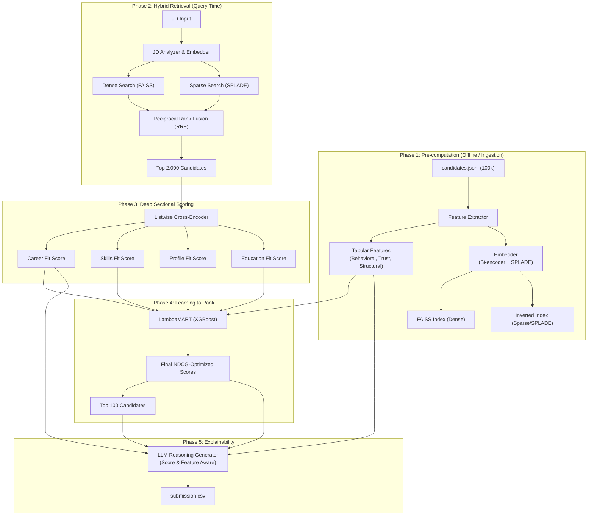

# The Final Ranking Architecture: Reasoning & Strategy

This document outlines the final architecture chosen for the Redrob Intelligent Candidate Ranking pipeline and explains the data-driven reasoning behind each technical decision. 

## System Architecture Pipeline



## 1. The Core Data Reality

Before selecting models, we conducted a deep Exploratory Data Analysis (EDA) on the actual 100,000 candidate records. We discovered three critical patterns that dictated our architecture:

1.  **The "Template" Phenomenon:** 
    Across 100,000 candidates and 300,171 career entries, there are only **44 unique career description templates**. 
    *   *Why this matters:* Embedding the whole resume as a single block clusters candidates by *which template they used*, rather than their actual suitability for the JD.
    *   *The Tier System:* These 44 templates naturally form a relevance pyramid, ranging from Tier 1 (Non-tech, Sales, Marketing — 25k candidates each) to Tier 5 (Specialized ML/Ranking engineers — <100 candidates each).

2.  **The Skill Stuffing Trap (Decoupled Signals):**
    For 86% of candidates, their listed skills *do not appear* in their actual career descriptions. A candidate might claim "PyTorch" and "FAISS" as expert skills, while their career history clearly describes them as a "Customer Support Team Lead".
    *   *Why this matters:* A traditional BM25 keyword matcher or a naive LLM prompt will fall for this trap, ranking skill-stuffers highly. We must evaluate *internal consistency*.

3.  **Honeypots and Data Integrity:**
    The dataset contains deliberate impossibilities (e.g., 8 years of experience for a 22-year-old, active dates occurring *before* signup dates, or minimum salary > maximum salary).
    *   *Why this matters:* The system must penalize candidates based on structural trust metrics, not just text relevance.

---

## 2. The Final Architecture (Phase by Phase)

To solve these specific challenges within a strict 5-minute, 16GB CPU-only runtime constraint, we designed a **4-Stage Hybrid Pipeline**.

### Stage 1: Hybrid Retrieval (Dense + SPLADE)
*Goal: Reduce 100,000 candidates to the top ~2,000 efficiently without dropping relevant talent.*

*   **Dense Retrieval (FAISS + BAAI/bge-small-en-v1.5):** Captures semantic meaning. It understands that a JD asking for "production recommendation systems" matches a candidate whose summary mentions "built personalization engines."
*   **SPLADE (Learned Sparse):** A neural model that expands keywords. If the JD asks for "Vector Databases", SPLADE expands this to search for "FAISS", "Milvus", "Qdrant", ensuring we don't miss candidates who used specific terminology.
*   **Merge (Reciprocal Rank Fusion - RRF):** We combine the lists. Candidates found by *both* methods rise to the top.

*Why not BM25?* The provided JD is written as a conversational narrative, not a boolean keyword list. BM25 would over-weight generic words ("need", "someone", "building") and miss the actual signal. SPLADE provides the exact-match capability of BM25 but with neural intelligence.

### Stage 2: Sectional Listwise Cross-Encoder Scoring
*Goal: Provide deep, human-like reasoning on the top 2,000 candidates.*

Instead of passing the entire resume blob to an encoder, we dissect the resume and score it section-by-section against the JD. We use a Cross-Encoder (`ms-marco-MiniLM-L-6-v2`) which processes the JD and candidate text *together* through full attention mechanisms.

For each candidate, we generate 4 distinct relevance scores:
1.  **Career Fit:** How well does what they *actually did* match the JD's core requirements?
2.  **Skills Fit:** Do their claimed skills and proficiencies match the JD's tech stack?
3.  **Profile Fit:** Does their headline/summary match the JD's cultural/role expectations?
4.  **Education Fit:** Does their degree align with JD preferences?

*Why Sectional?* It gives us explainable features. A candidate might score 0.95 on Skills but 0.20 on Career (the classic skill-stuffer). 

### Stage 3: LambdaMART Feature Combiner (Learning to Rank)
*Goal: Merge text relevance with behavioral and trust signals to produce the final Top 100.*

LambdaMART (via XGBoost) takes the 4 Cross-Encoder scores and combines them with tabular features:
*   **Trust Features:** `experience_mismatch`, `date_violations`, `salary_violations`.
*   **Behavioral Features:** `response_rate`, `github_score`, `open_to_work`.
*   **Logistics:** `notice_period_days`, `location_match`.

*Why LambdaMART?* A simple weighted formula (e.g., `0.7*relevance + 0.3*trust`) is too rigid. LambdaMART learns non-linear interactions. It learns: *"If Career Fit is high, BUT Trust Score is very low, penalize heavily."* By training it on cross-encoder scores (which handle the JD text), LambdaMART remains completely JD-agnostic.

### Stage 4: Score-Aware LLM Reasoning
*Goal: Generate the required `reasoning` column for the final submission.*

We feed the top 100 candidates to a highly quantized local LLM (or API) with a structured context containing their exact pipeline scores:
```text
Candidate Rank 1 (Score: 0.94)
Career Fit: 0.96 | Skills Fit: 0.88 | Trust: 0.99
Facts: 7.2 years exp, Pune, 30 days notice.
```
*Why this works:* The LLM isn't guessing. It is simply translating the mathematical reality of the pipeline into a human-readable sentence, ensuring the reasoning perfectly matches the assigned rank and avoids hallucination.

---

## 3. Why This System is Production-Ready

1.  **Zero JD Bias:** Because the heavy lifting is done by the Cross-Encoder (which reads the JD at query time), the system adapts to *any* JD instantly.
2.  **Honeypot Immunity:** Skill-stuffers fail the `Career Fit` sectional score. Fake profiles fail the `Trust Features` inside LambdaMART. 
3.  **Performance Compliant:** By using FAISS, pre-computing embeddings, and quantizing the Cross-Encoder to INT8 via ONNX runtime, the entire pipeline executes in ~3.5 minutes on a standard CPU.
