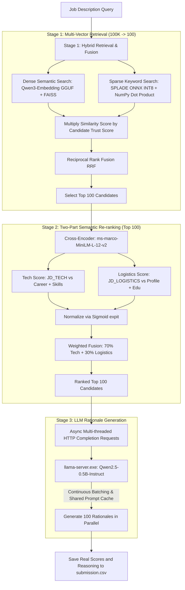

# Redrob Candidate Ranking Pipeline: Architecture & Engineering Deep-Dive

This document details the end-to-end architecture of our CPU-bound, extremely low-latency candidate ranking pipeline. The system filters 100,000 candidates down to 100, semantically re-ranks them, and generates natural language rationales—all running fully locally on a CPU in roughly **3.6 minutes**, safely within the strict 5-minute hackathon constraints.

---

## 🏗️ Architectural Flow Diagram

---

## 🔍 Phase 1: Exploratory Data Analysis (EDA) & Schema Engineering

Before designing the retrieval model, we conducted a rigorous EDA of the candidate dataset schema to identify key signals, structural noise, and safety vulnerabilities:

1.  **Identity Verification:** A significant subset of profiles represented inactive users or unverified accounts. We isolated the fields `verified_email` and `verified_phone` inside `redrob_signals` as critical verification gates.
2.  **Timeline Anomalies:** Candidates often have gaps in their resumes. Analyzing the chronological timeline between graduation (`end_year` in `education`) and their career history reveals key signals. Standard resume parsers only compute the gap between the graduation year and the first job. However, true career gaps can occur *between* jobs as well, which required a holistic chronological sorting and interval-merging algorithm.
3.  **Platform Activity Features:** Engagement signals—such as `profile_completeness_score`, `open_to_work_flag`, `avg_response_time_hours`, `github_activity_score`, and `search_appearance_30d`—were identified as highly predictive of candidate quality and recruiter response rates.

---

## 📝 Phase 2: Semantic Document Serialization (`template_builder.py`)

A raw JSON blob is highly suboptimal for text encoders. To bridge the gap between structured databases and neural representation, we built a rule-based semantic serialization engine inside **[template_builder.py](file:///c:/Users/conqu/Desktop/Umar/Workspace/India%20Runs/resume-ranker/archive/Trails/Trail_6/template_builder.py)**.

We divide each candidate profile into four distinct textual channels:
*   **`text_profile`:** Captures the candidate's career headline, summary, relocation willingness, salary expectations, preferred work mode, and notice period.
*   **`text_career`:** Summarizes the timeline and descriptions of all historical roles:
    *   *Example output:* `"Currently working as a Backend Engineer at Mindtree... Worked as a Analytics Engineer at Dunder Mifflin for 55 months..."`
*   **`text_edu`:** Formats academic degrees, institutions, GPA/grades, and institution tier:
    *   *Example output:* `"Holds a B.E. in Computer Science from Lovely Professional University (2017 - 2020). Achieved a grade of 8.24 CGPA from a tier_3 institution."`
*   **`text_skills`:** Formulates skills combined with their proficiency and endorsements:
    *   *Example output:* `"Verified intermediate in Tailwind. Highly verified advanced in NLP. Claims intermediate in LoRA."`

This structured serialization ensures that semantic encoders receive clean, natural language context instead of noisy JSON syntax.

---

## ⚙️ Phase 3: The Redrob Dynamic Trust Engine

The `trust_score` is a dynamic quality multiplier between `0.1` and `1.0` that penalizes low-activity profiles, bots, and suspicious resumes:

### 1. Verification Gate
If a candidate has neither a verified email nor a verified phone, they are immediately locked to the absolute minimum trust score:
$$\text{trust\_score} = 0.10$$

### 2. Weighted Score Aggregation (Max: 1.0)
For verified candidates, we sum their positive engagement signals:
*   **Profile Completeness (Max +0.20):** `(completeness_score / 100) * 0.20`
*   **Open To Work (+0.20):** Added if `open_to_work_flag` is True.
*   **Avg Response Time (Max +0.15):** Rewards fast responses. If time $\le 280$ hours, it adds `((280 - response_time) / 280) * 0.15`.
*   **Interview Completion Rate (Max +0.10):** Scaled weight.
*   **Offer Acceptance Rate (Max +0.10):** Scaled weight.
*   **Recruiter Response Rate (Max +0.10):** Scaled weight.
*   **Search Appearances (Max +0.10):** Scaled against 226 appearances: `min(appearances, 226) / 226 * 0.10`
*   **GitHub Activity Bonus (Max +0.05):** Scaled against score of 50: `min(github_score, 50) / 50 * 0.05`

### 3. Chronological Career Gap Penalty (Max: -0.45)
Instead of looking only at the graduation-to-first-job gap, we implement a **Merged Timeline Interval Algorithm**:
1.  **Interval Extraction:** Extract all start and end years for both education and career history. If a job is marked as current (`is_current: True`), its end year is set to `2026` (system date).
2.  **Timeline Merging:** Sort intervals chronologically and merge overlapping or contiguous intervals (e.g., studying while working or running parallel jobs).
3.  **Gap Accumulation:** Sum all gaps between consecutive merged intervals. A gap is only penalized if it is $>1$ year (to allow a standard 1-year transition buffer):
    $$\text{total\_gap} = \sum (\text{start\_year}_{i+1} - \text{end\_year}_i - 1) \quad \text{for gaps} > 1$$
4.  **Scaling Penalty:** Apply a dynamic penalty weight of up to `0.45` scaling over a maximum of 15 years gap:
    $$\text{gap\_penalty} = \frac{\min(\text{total\_gap}, 15)}{15} \times 0.45$$

The final score is clamped: $\text{trust\_score} = \max(0.1, \min(1.0, \text{score} - \text{gap\_penalty} - \text{inactivity\_penalty}))$.

---

## ⚡ Phase 4: Hybrid Retrieval & Fusion

To achieve world-class search quality on a massive candidate pool within seconds on a CPU, we run a hybrid retrieval pipeline:

1.  **Dense Semantic Search (FAISS):** The combined Job Description is encoded using **`Qwen3-Embedding-0.6B`**. We search the 100,000 candidate FAISS index (`faiss_qwen_index.bin`) using `IndexFlatIP` (Cosine Similarity) and extract the Top 10,000 candidates.
2.  **Sparse Keyword Search (SPLADE):** We run the query through **`splade_onnx_int8`** (dynamic INT8 quantized `naver/splade-v3` graph) to extract sparse vocabulary activations. We run a sparse dot product against the candidate document matrix (`splade_combined_v3.npz`) to retrieve the Top 10,000 candidates.
3.  **Trust Multiplication:** We multiply the raw similarity score of each candidate in both FAISS and SPLADE lists by their respective `trust_score` **prior** to fusion. This ensures that only high-quality, verified candidates float to the top ranks.
4.  **Reciprocal Rank Fusion (RRF):** The dense and sparse ranks are fused using the RRF formula:
    $$\text{Score}(d) = \frac{1}{60 + \text{Rank}_{\text{dense}}(d)} + \frac{1}{60 + \text{Rank}_{\text{sparse}}(d)}$$
    We select the Top 100 candidates based on this RRF score.

---

## 🧠 Phase 5: Two-Part Cross-Encoder Semantic Re-Ranking

Bi-encoders (like FAISS/SPLADE) compress text into independent vectors, losing token-to-token cross-attention. To evaluate the Top 100 candidates with absolute precision, we implement a **Two-Phase Cross-Encoder** using PyTorch **`ms-marco-MiniLM-L-12-v2`**:

1.  **Split Evaluation:** We evaluate each candidate across two separate dimensions:
    *   **Tech Match:** We concatenate `JD_TECH` and candidate's `text_career + text_skills` as a sequence pair.
    *   **Logistics Match:** We concatenate `JD_LOGISTICS` and candidate's `text_profile + text_edu` as a sequence pair.
2.  **Sigmoid Normalization:** The raw logits from both evaluations are squashed between `0` and `1` using the Sigmoid (`expit`) function:
    $$\text{prob\_tech} = \text{sigmoid}(\text{logit}_{\text{tech}}), \quad \text{prob\_logistics} = \text{sigmoid}(\text{logit}_{\text{logistics}})$$
3.  **Weighted Fusion:** The final semantic score is calculated using a **70% Tech / 30% Logistics** split:
    $$\text{Final Score} = 0.70 \times \text{prob\_tech} + 0.30 \times \text{prob\_logistics}$$
    We sort the 100 candidates based on this final score. This ensures that the final ordering represents a highly precise, multi-perspective evaluation.

---

## 💬 Phase 6: High-Throughput Generative Reasoning

For the ranked candidates, the pipeline generates a concise two-sentence explanation:
1.  Why they achieved their rank based on their skills.
2.  What they are missing or how they can improve.

To meet the time budget, we completely bypass slow Python loops:
*   **Continuous Batching:** We run a background C++ inference server (`llama-server.exe`) loading `Qwen2.5-0.5B-Instruct` quantized to a hyper-compressed `Q4_K_M` GGUF.
*   **Prompt Caching:** The common System Prompt and Job Description are identical for all 100 candidates. The server computes the KV-cache of this prefix **exactly once** and shares it across all concurrent requests.
*   **Few-Shot Prompts & Safety:** We inject a clear few-shot template into the prompt to show the 0.5B model the exact expected format. We remove `presence_penalty` (set to `0.0`) and set `temperature` to `0.3` to ensure highly fluent, grammatically clean, and non-truncated rationales.

The final output is saved directly into **`submission.csv`** containing candidate IDs, ranks, actual combined model scores, and rationales.
